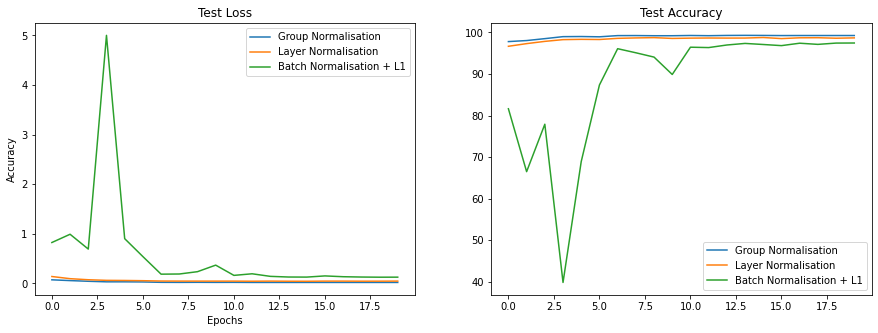
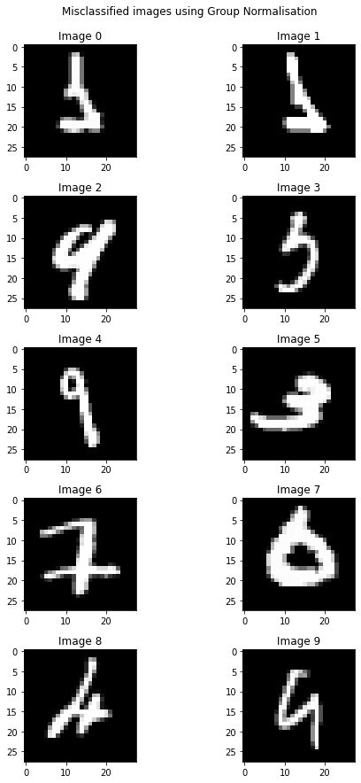
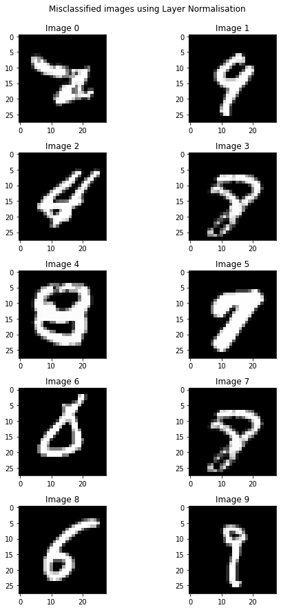
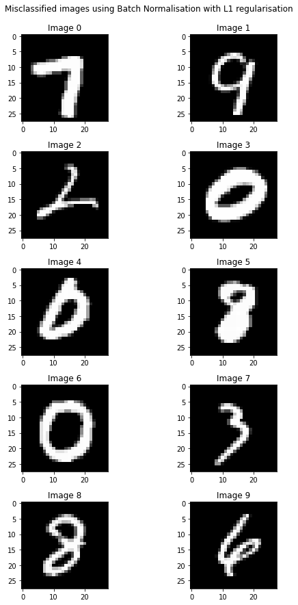

# SESSION 5 - BATCH NORMALIZATION & REGULARIZATION

## This assignment is about 3 normalisation techniques
### 1. Batch normalisation:
At each layer, we take the mean and variance of each channel and then normalize all the values in that channel using the mena and variance. So, the number of means and variances is equal to number of channels

### 2. Layer normalisation:
At each layer, we take the mean and variance of each image and then normsalize all the values/pixels in the image with these means and vaeiances. So, the number of means and variances is equal to number of images which is equal to the batch size

### 3. Group Normalisation (with L1 regularisation):
At each layer, we divide the number of channels into multiple groups and then for each group, we calculate the batch normalisation. The number of meand and variances that we need to calculate is number of groups * layer normalisation

## Code:
The code is divided into two files:
#### 1. model.py: 
This file contains the network for all three normalisation
#### 2. main.ipynb: 
This notebook contains the code for all the remaining tasks like data loader, train and test and the graphs, the respective model is selected from the model.py file using the task_name argument in the get_model() function. All the function are commented and have the docstring in them

## Comparison of eest losses and accuracies using all three normalisations:

Left figure (Test loss), Right loss (Test accuracy)
From the above grpah: Left figure (Test loss), we can see that the loss is high in starting, it fluctuates then drops. But in case of group and layer normalisation, the loss is smooth from the starting.
From the above grpah: Right figure (Test Accuracy), we can see that the accuracy is low in starting, it fluctuates then increases. But in case of group and layer normalisation, the loss is smooth from the starting.

## Misclassified images
### Group normalisation 
 

### Layer normalisation
 

### Batch normalisation with L1 regularisation
 