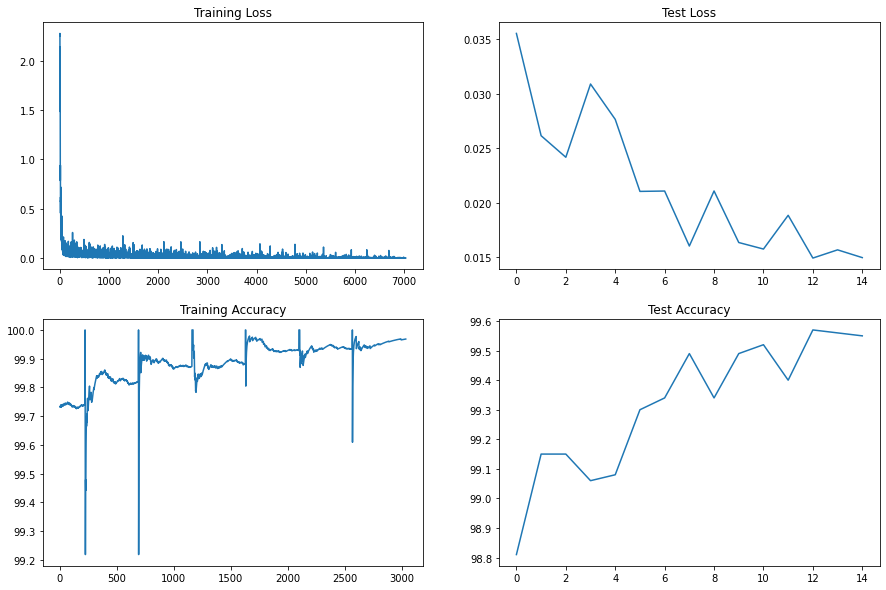
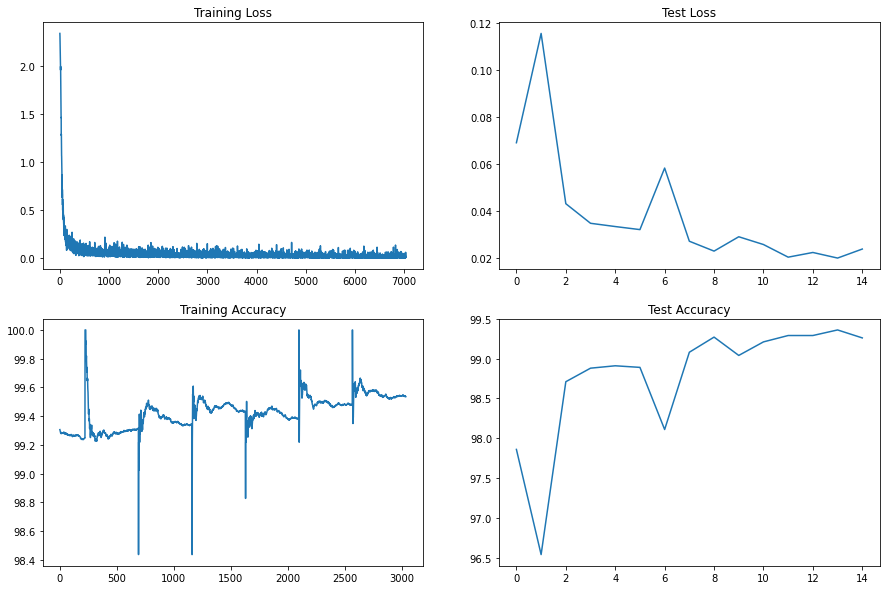
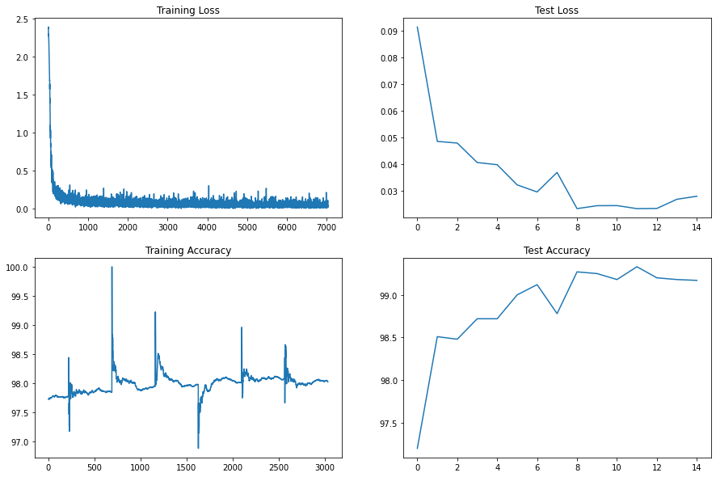
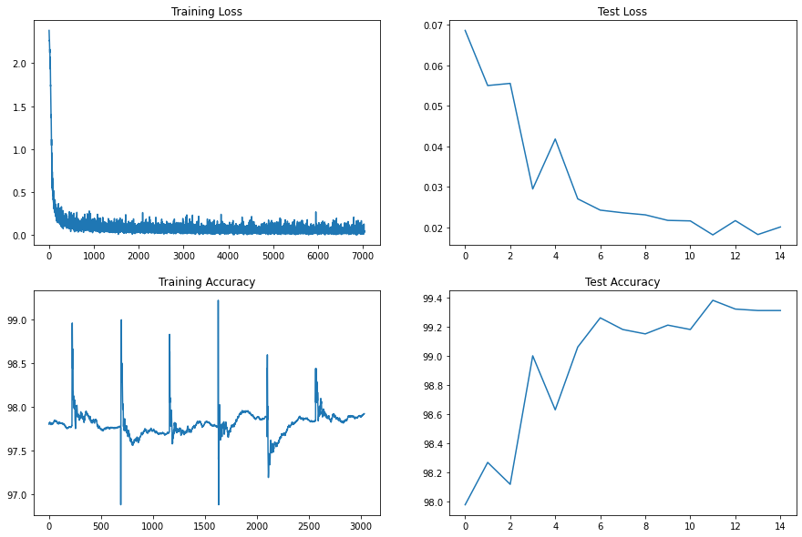
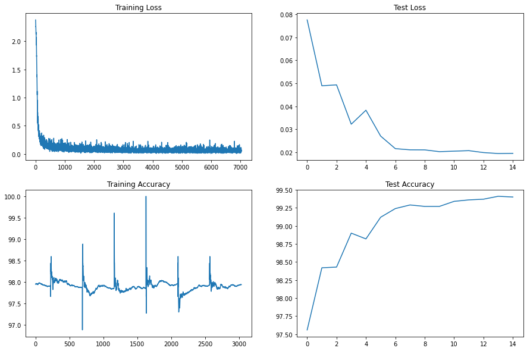

# EVA-8 Assignment 4 (Coding Drill Down): 
###### Achieve 99.4% accuracy in less than or equal to 15 Epochs andLess than 10000 Parameters (additional points for doing this in less than 8000 pts). I have divided the task into 5 steps starting from basic setup to using things like dropout, batch normalisation, learning rate scheduler and image augmentation. I have created 5 notebooks one for each step. At the starting of each notebook, I have written the target, analysis and results. Following are the targets, results and analysis we get from each step

## STEP-1 (Get the basic setup right)
    Target:
    
        -- Get the set-up right
        -- Set Transforms
        -- Set Data Loader
        -- Set Basic Working Code
        -- Set Basic Training  & Test Loop
        -- Use batch normalisation 
    
    Results:
    
        -- Parameters: 6,383,818
        -- Best Training Accuracy: 99.97
        -- Best Test Accuracy: 99.56
  
    
    
    Analysis:
    
        -- The accuracy is really good. 
        -- The model is starting to overfitting in last few eopchs as the test accuracy is decreasing along with the training accuracy
        -- model is really heavy. 6.3M parameters are really heavy
 

## STEP-2 (Reducing the number of parameters)
    Target:
    
        -- Our previous model has 6.3M parameters. I want to reduce these parameters here. I want to make them < 10K
    
    Results:
    
        -- Parameters: 9,916
        -- Best Training Accuracy: 99.53
        -- Best Test Accuracy: 99.36
     
    
    Analysis:
    
        -- The accuracy has dropped a little (from 99.56 to 99.36) after reducing the number of parameters
        -- training and test accuracy are increasing with epochs. So we are in the right path. We might improve results by training it for few more epochs. We will keep number of epochs to 15 and increase it if required in future

## STEP-3 (Introducing dropouts)
    Target:
    
        -- In the previous step we had 9,970 parameters. In this step we want to
        improve this accuracy by using dropouts. We will use a dropout rate of 0.05 
    
    Results:
    
        -- Parameters: 9,970
        -- Best Training Accuracy: 98.07
        -- Best Test Accuracy: 99.33
     
    
    Analysis:
    
        -- There is a slight drop in test accuracy after introducing dropouts.
        -- In last few epochs, we can see that the training accuracy is increasing but the test accuracy is going up and down. This might be because of overfitting. 

## STEP-4 (Introduction Image augmentation)
    Target:
    
        -- TO introduce accuracy we want the model to train on more difficult data. So we are introducing image augmentation in this step
    
    Results:
    
        -- Parameters: 9,970
        -- Best Training Accuracy: 97.92
        -- Best Test Accuracy: 99.38
       
    
    Analysis:
    
        -- The accuracy has improved compared to previous step
        -- The training accuracy is increasing but test accuracy is fluctuating a little. The model is not able to find the minu=ima. So, we need to introduce learning rate schedular

## STEP-5 (Introducing learning rate)
    Target:
    
        -- In the last step, we saw that the training accuracy is increasing but the test accuracy is going up and down a little (which means the model is not able to find minima). So, we want to introduce learning rate now
    
    Results:
    
        -- Parameters: 9,970
        -- Best Training Accuracy: 97.93
        -- Best Test Accuracy: 99.41
      
    
    Analysis:
    
        -- The accuracy has increased a little (from 99.38 to 99.41) after introducing learning rate scheduler.
        -- There is still some possibility of improvement as the test accuracy is increasing with increase in train accuracy