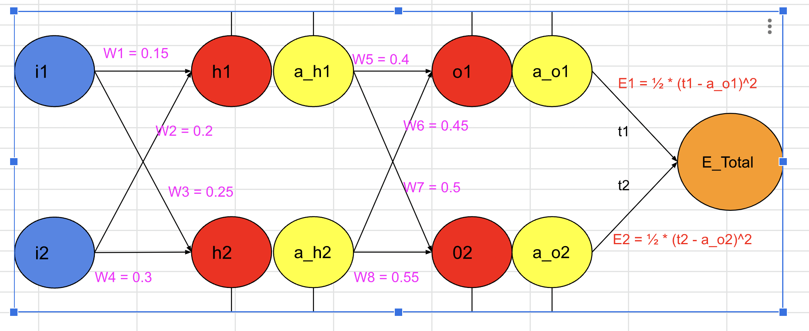
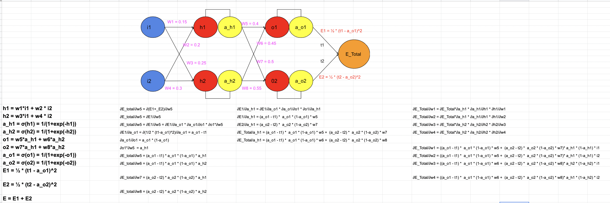
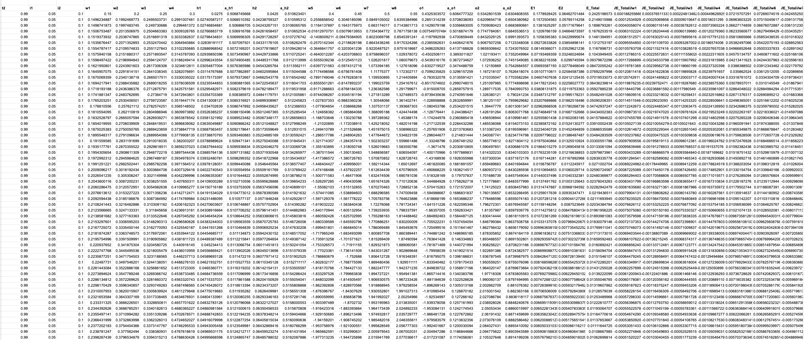
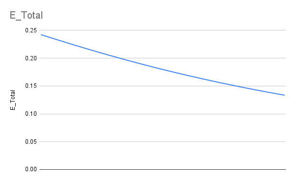
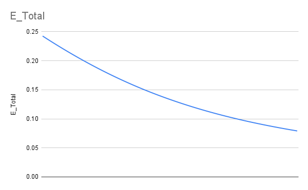
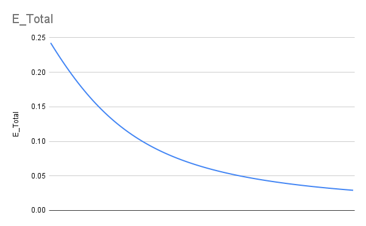
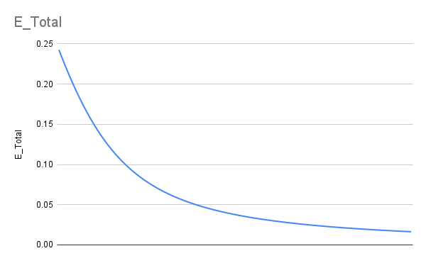
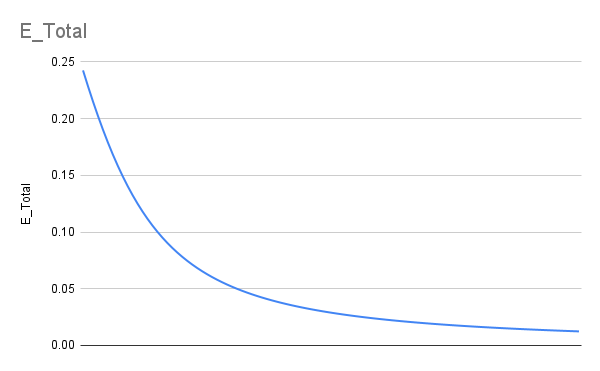
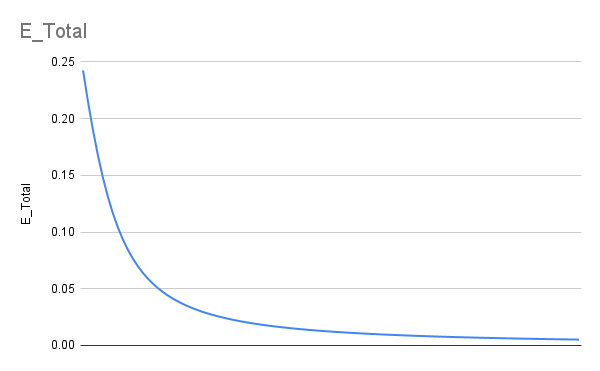

# EVA-8 Assignment3 (Creating a simple neural network in Excel sheet

## PART-1

In this assignment, we are asked to create a simple neural network using the backpropagation rule in an excel sheet. The network for which, we need to build the formula is shown below:

In the first row, we start by adding random weights w1, w2, w3, w4, w5, w6, w7, w8 
Then we fill other values using the formula based on the model and using backpropogation. The formulas look as follows:

In the second row, we update all the weights using this formula (w1 = w1-η*∂E/∂w1). The remaining values are filled with the new weights in second row

We repeat the above process for more than 100 rows (representing 100 epochs). Following image shows, how things look after several epochs:

We tried different values of learning rate (η)
η=0.1

η=0.2

η=0.5

η=0.8

η=1.0

η=2.0

From, above image we can see the loss converges faster when we increase the learning rate. 

## PART-2 

In this part, we are asked to achieve 99.4% validation accuracy in 20k and ess than 20 Epochs. We are allowed to do things like batch normalization, dropouts, Global average pooling. 

My network has 16,196 parameters. I am using dropout in each colvolution layer with rate of 0.05 and batch normalization in each layer except the last layer. I achieved validation accuracy of 99.48%. PART-2.ipynb contains the code and I am also attached a pdf version of the code file. 